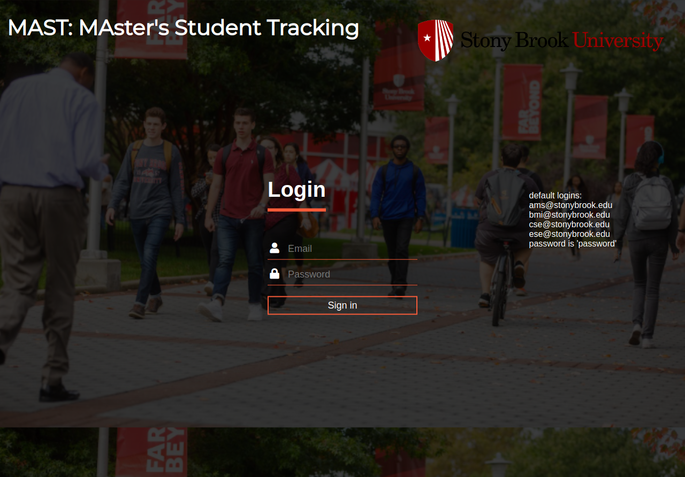
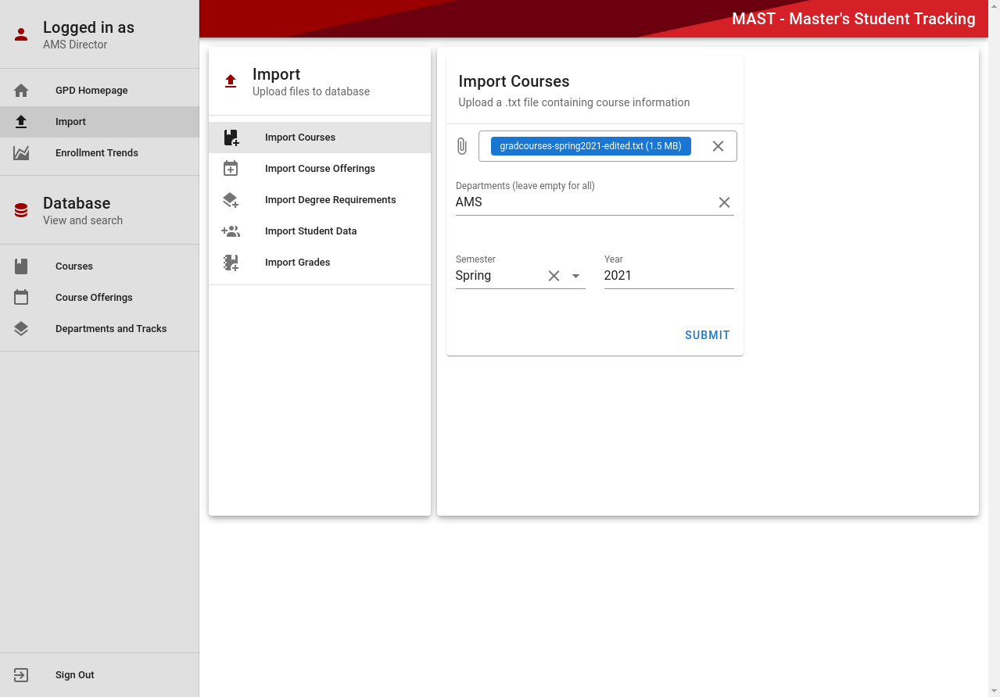
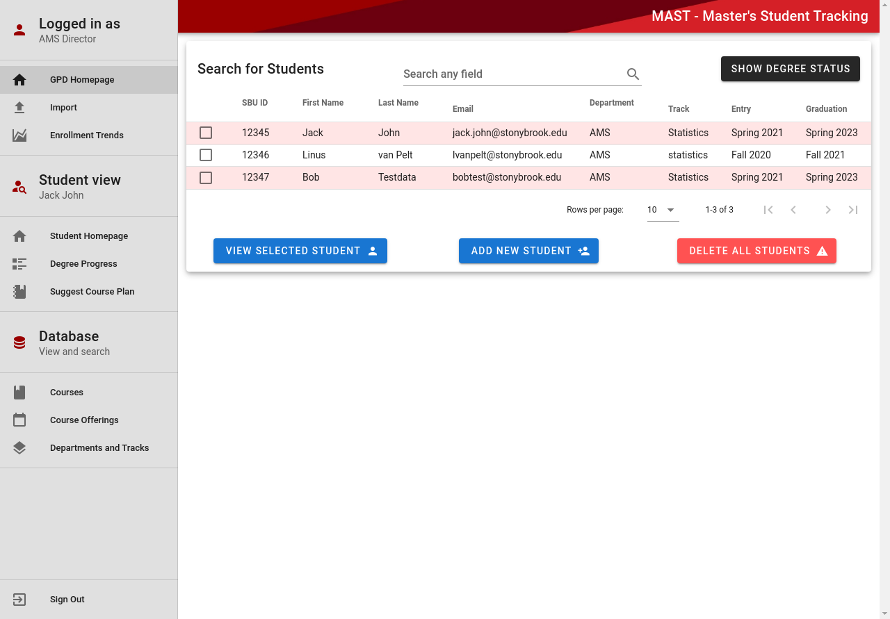
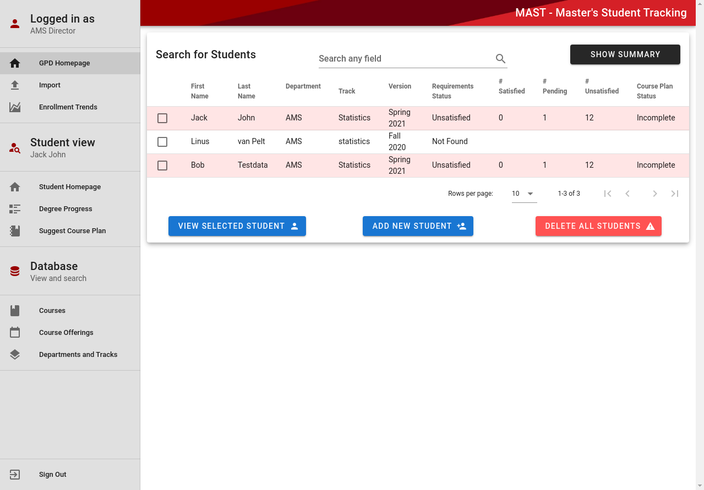
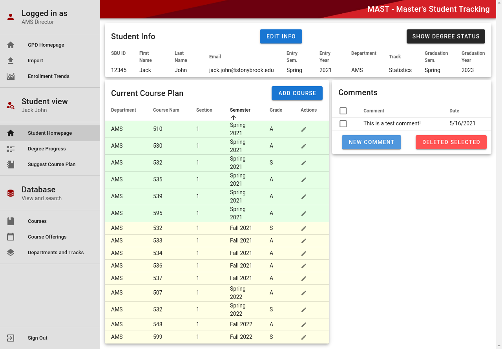
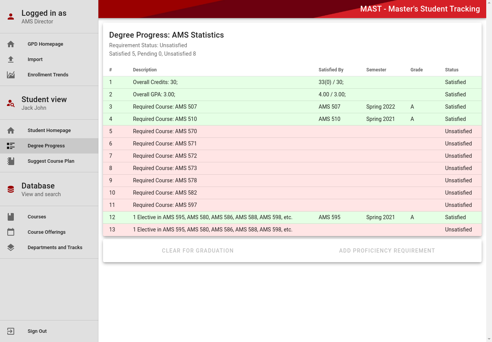
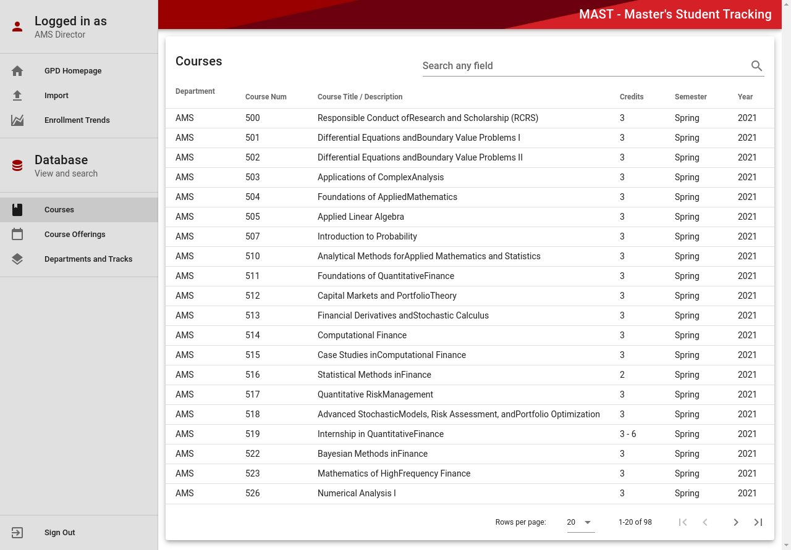
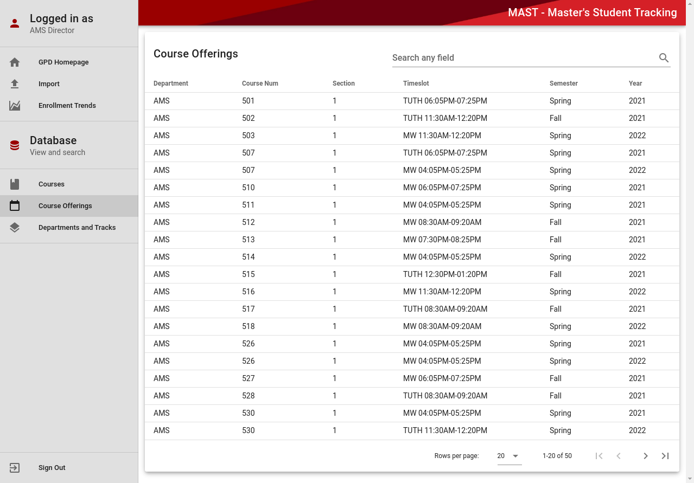

# MAster Student Tracking (MAST)
MAster's Student Tracking (MAST)

Insert functionality here

## How to build and start
```
npm install
npm run build
npm start
```
Note - Make sure you use https://localhost:8000 instead of http://localhost:8000

## MAST
* MAST is a system that helps M.S. students and graduate program directors (GPDs) determine whether students are on track to satisfy degree requirements for their respective major (currently supports majors applied math, computer science, biomedical engineer, and electrical engineering) by their planned graduation date, the system will also help departmental administrative staff know when to clear a student for graduation.
* This was a project I completed along with three other students for the capstone course CSE 416
* For more information about all of the requirements of the system, look at project-mast.html

## Tech Stack
    * Front-end: Vue.js
    * Back-end: Node + Express
    * Database: MySQL
    * ORM Framework: Sequelize
    * Authentication: JSON Web Token

## Project Images

* Login Screen <br> 

* Import Page <br> 

* GPD Home Page <br> 

* GPD Home Page with Degree Status <br> 

* Student Home Page <br> 

* Student Degree Progress <br> 

* Courses Page <br> 

* Course Offerings Page <br> 
