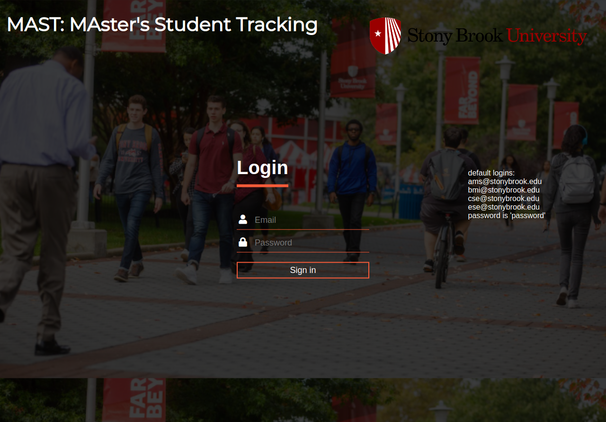
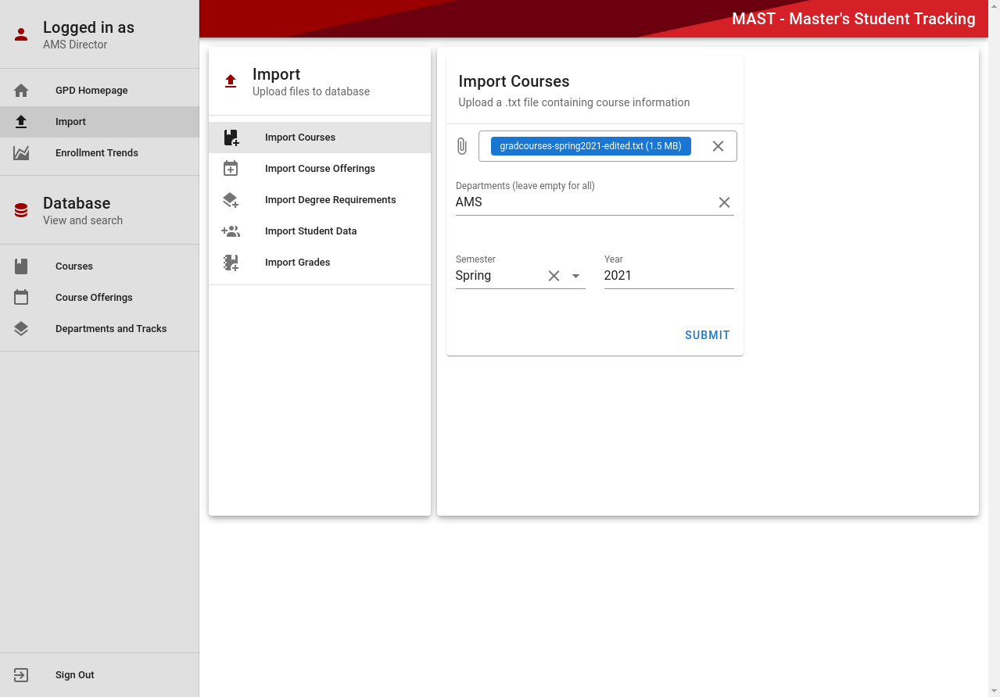
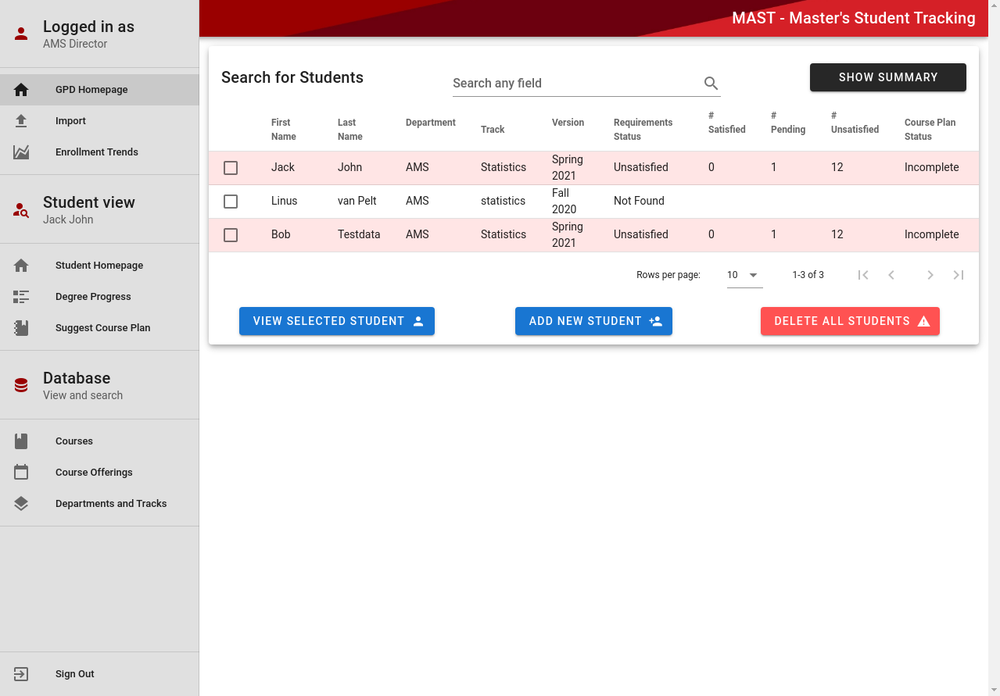
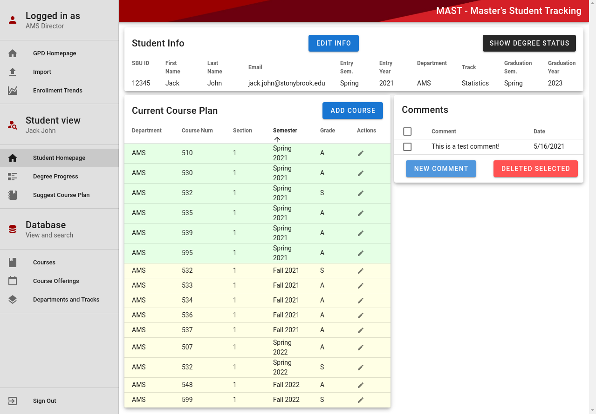
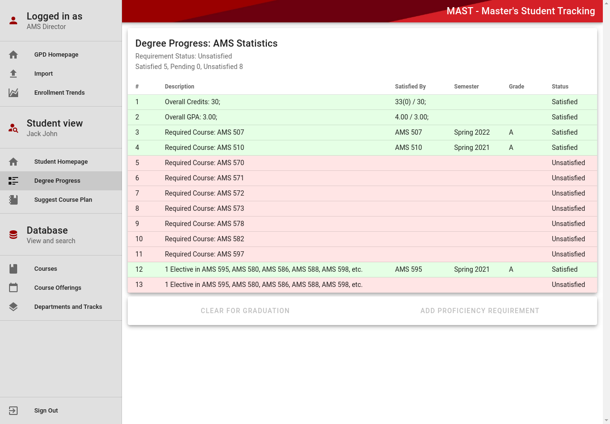
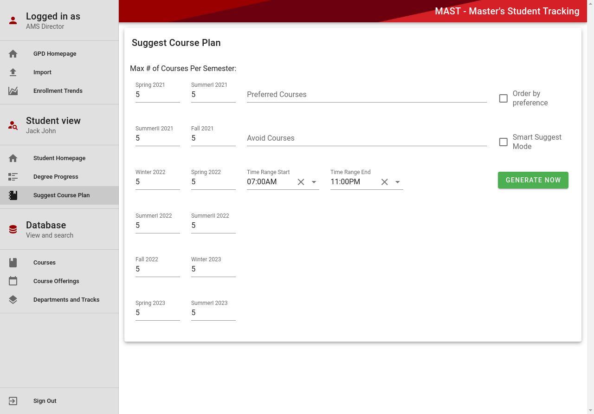
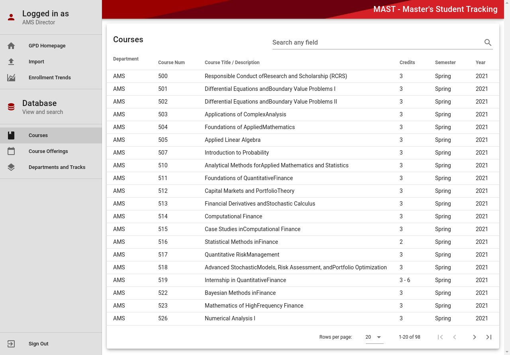
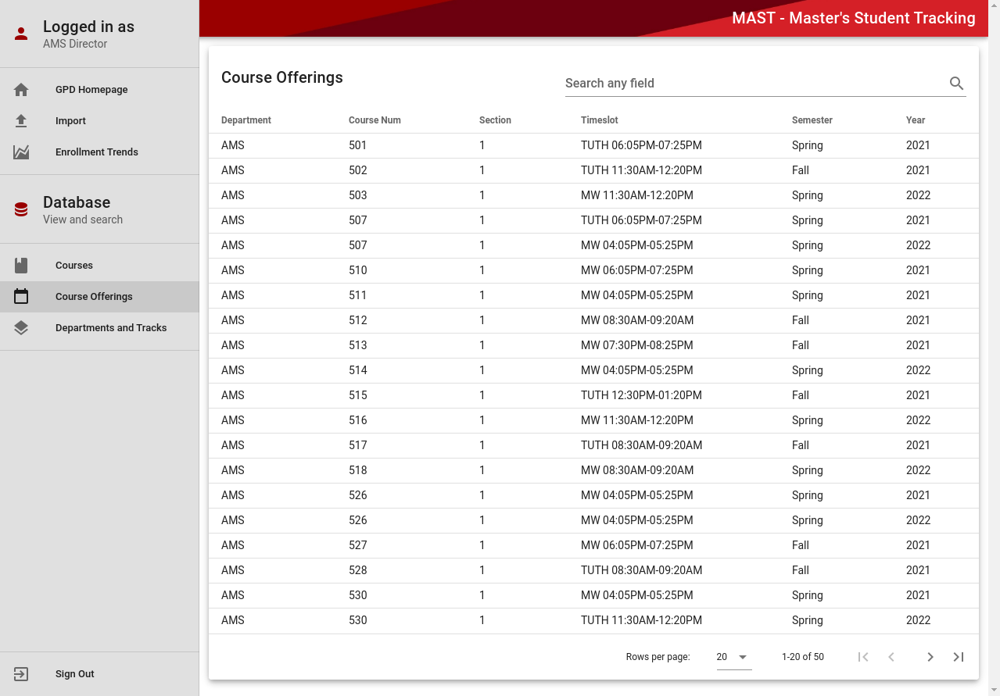
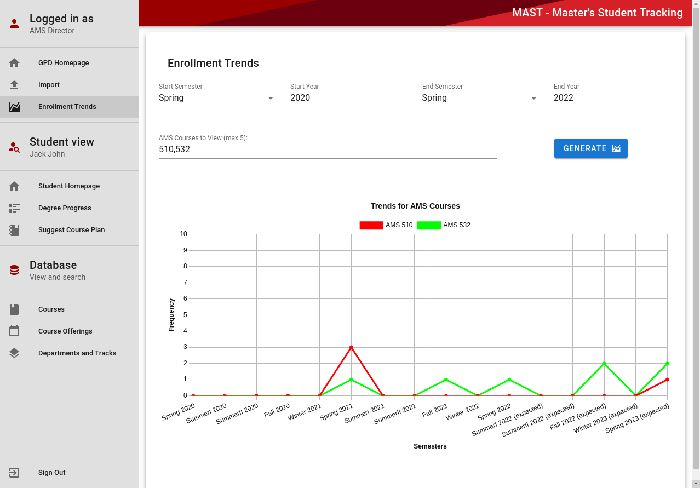

# MAster Student Tracking (MAST)

Remote system accessible at https://ma-st.herokuapp.com/ (You still have to clone the github repo and import the courses, course offerings, degree requirements, and student data however)

MAST is a full stack web application system that helps M.S. students and graduate program directors (GPDs) determine whether students are on track to satisfy degree requirements for their respective major by their planned graduation date. The system will also help departmental administrative staff know when to clear a student for graduation. This was a project I completed along with three other students for the capstone course CSE 416.

## MAST System Functionality Overview

    * System supports logging in as either a GPD or student (with different functionality for each)
    * System can import courses, course offerings, degree requirements for supported majors, student data, and grades for courses a student has completed
    * System supports four majors: applied mathematics, computer science, biomedical engineering, and electrical engineering
    * System allows GPDs to create, edit, search for, and delete students as well as modify their grades, add comments to their page and view their degree progress
    * System allows students to edit their own information (except their entry semester/year), and view their degree progress
    * System allows students to use Suggest Course Plan, an advanced algorithm that creates multiple course plan for a student based on any unsatisfied requirements they have to graduate, so that the student can choose the plan they like best
    * System allows GPD to view a chart that visualize trends in the past and expected (based on course plans) enrollment of specified courses, for a specified range of semesters for the GPD to view
    * System supports HTTPS encryption

For a more comprehensive description about all of MAST's functionality, look at project-mast.html

## How to build and start
```
npm install
npm run build
npm start
```
Note - Make sure you use https://localhost:8000 instead of http://localhost:8000

## Tech Stack
    * Front-end: Vue.js
    * Back-end: Node + Express
    * Database: MySQL
    * ORM Framework: Sequelize
    * Authentication: JSON Web Token

## Project Images

* Login Screen <br> 

* Import Page <br> 

* GPD Home Page <br> 

* GPD Home Page with Degree Status <br> 

* Student Home Page <br> 

* Student Degree Progress <br> 

* Suggest Course Plan <br> 

* Courses Page <br> 

* Course Offerings Page <br> 

* Enrollment Trends <br> 